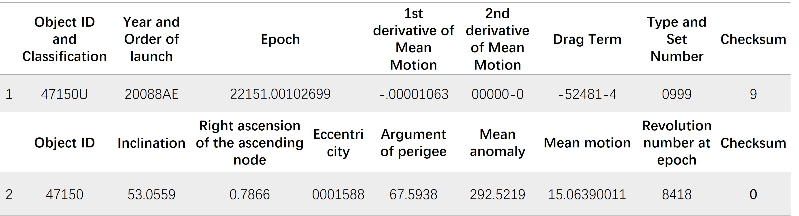
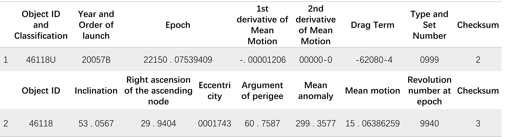

# Dataset

This folder includes the data used for the empirical study and evaluation in [1].

We collect two datasets on space situational awareness:

- Two-line elemnt(TLE):TLEs are NASA’s stan-dard format of encoding space objects’ trajectories. Each TLE entry encodes a space object’s orbital elements for a given point in time (the epoch). It is observed by ground-based radars, telescopes, or satellites’onboard sensors. Given this TLE, one could predict its up-coming position and velocity using orbit propagators such as SGP4 if no orbital maneuvers were conducted. We collect all 41,188,538 TLEs in 2019/05–2022/07 from space-track.org, resulting in a dataset of 8,487 satellites,15,061 pieces of space debris, and 689 other space objects.
- Conjunction report:Conjunction report are standardized messages to describe the upcoming conjunction events betweenspace objects. Each conjunction report encodes a pair of space objects’ types, operators, positions, velocities, their uncertainties (covariances), miss distance, and collision probability at the time of closest approach(TCA). With conjunction reports, satellite operators can assess the collision risks and coordinate orbital maneuvers. We collect conjunction reports in 2022/04–2022/08 from celestrak.org, forming a dataset of 9,350,134reports between 21,743 pairs of space objects.

TLE format:

Conjunction data format:

Due to the large dataset, it cannot be shown here, you have two ways to get this data

- Contact us by email
- Self collection

## References

[1] Yuanjie Li, Hewu Li, Wei Liu, Lixin Liu, Wei Zhao, Yimei Chen, Jianping Wu, Qian Wu, Jun Liu, Zeqi Lai, Han Qiu. A Networking Perspective on Starlink’s Self-Driving LEO Mega-Constellation. To appear at ACM MobiCom 2023.

