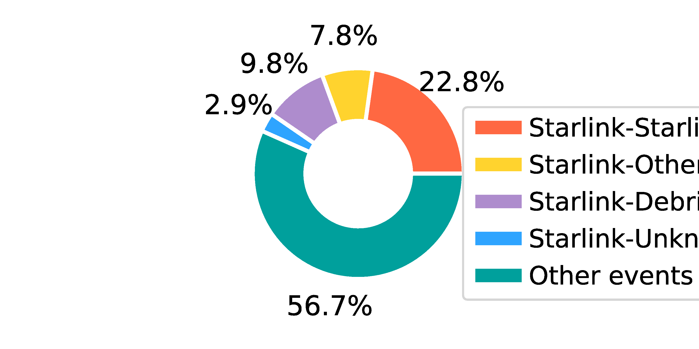
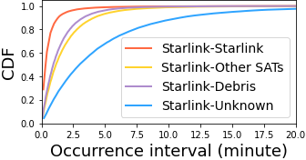

## Figure 10: Statistics of conjunction events.

<div align=center></div>

### Overview
Figure 10 shows the distribution of event types and occurrence interval of our conjunction dataset.


### Experimental methodology
Our experiments are based on counjunction from celestrack.org.


### How to run the code
```
jupyter notebook
open figure10.ipynb file and run notebook
```

### Data
The data can be found in the `figure10/` folder.

	|- figure10
		|- data
			|- frequency_conjunction.npy
			|- plot_distance_data.npy
			|- result.npy