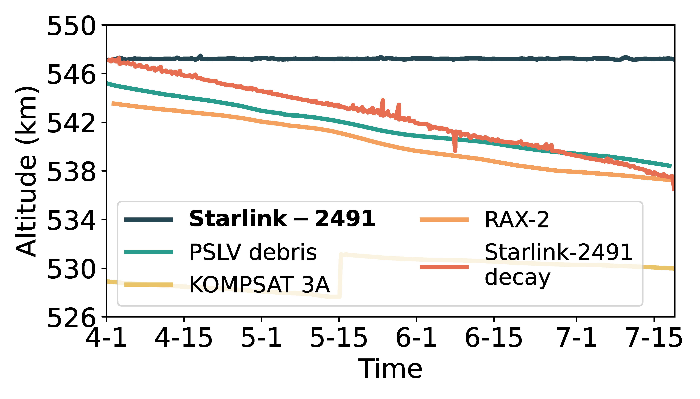

## Figure 12a: The necessity of orbit maintenance.

<div align=center></div>

### Overview
Figure 12a shows the necessity of orbit maintenance.
This figure is to illustrate how Starlink and other space objects' orbit change when they don't maintain their orbit. 


### Experimental methodology
Our experiments are based on Two-line elements from space-track.org.


### How to run the code
```
jupyter notebook
open figure12a.ipynb file and run notebook
```

### Data
The data can be found in the `figure12a/` folder.

	|- figure12a
		|- data
			|- 27216.csv
			|- 37853.csv
			|- 40536.csv
			|- 48148.csv