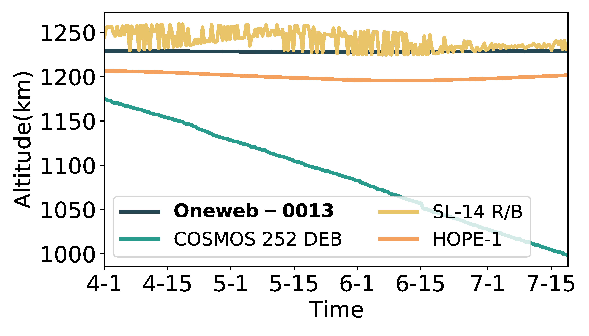

## Figure 12c&d: Orbital decays around Oneweb

<div align=center></div>

### Overview
Figure 12d shows orbital decays around Oneweb.
This figure is to illustrate how Oneweb and other space objects' orbit change when they don't maintain their orbit. 


### Experimental methodology
Our experiments are based on Two-line elements from space-track.org.


### How to run the code
```
jupyter notebook
open figure12d.ipynb file and run notebook
```

### Data
The data can be found in the `figure12c/` folder.

	|- figure12c
		|- data
			|- object_dict.npy