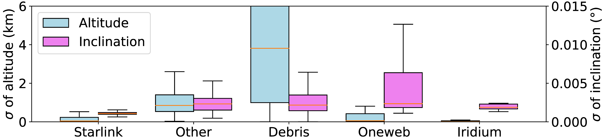

## Figure 13: Deviations of LEO orbital parameters.

<div align=center></div>

### Overview
Figure 13 shows deviations of LEO orbital parameters.
This figure is to illustrate the different deviations of Starlink, Iridium, Oneweb and other space objects.


### Experimental methodology
Our experiments are based on Two-line elements from space-track.org.


### How to run the code
```
jupyter notebook
open figure13.ipynb file and run notebook
```

### Data
The data can be found in the `figure13/` folder.

	|- figure13
		|- data
			|- std.npy