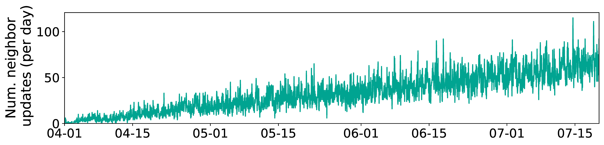

## Figure 14: Neighborship updates w/o maintenance.

<div align=center></div>

### Overview
Figure 14 shows neighborship updates w/o maintenance.


### Experimental methodology
Our experiments are based on Two-line elements from space-track.org.


### How to run the code
```
jupyter notebook
open figure14.ipynb file and run notebook
```

### Data
The data can be found in the `figure14/` folder.

	|- figure14
		|- data
			|- nearest_lw_0719.npy
			|- change_time.npy