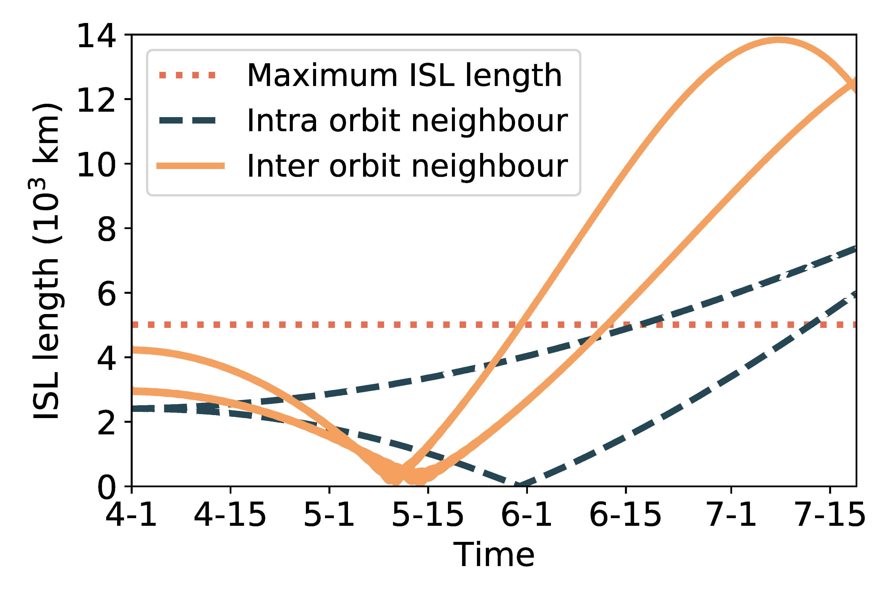
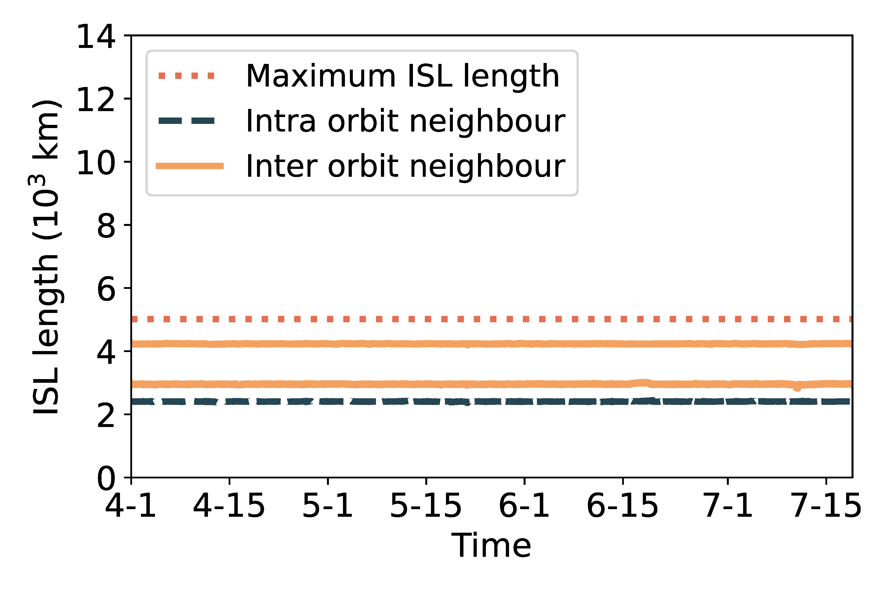

## Figure 15: Orbit maintenance’s impacts on ISLs.

<div align=center></div>
<div align=center></div>

### Overview
Figure 15 shows orbit maintenance’s impacts on ISLs.
This figure is to illustrate orbit maintenace conducive to stabilizing the inter-satellite link


### Experimental methodology
Our experiments are based on Two-line elements from space-track.org.


### How to run the code
```
jupyter notebook
open figure15.ipynb file and run notebook
```

### Data
The data can be found in the `figure15/` folder.

	|- figure12c&d
		|- data
			|- sat_1541.npy
			|- isl_data_decay.npy
			|- isl_data_no_decay.npy