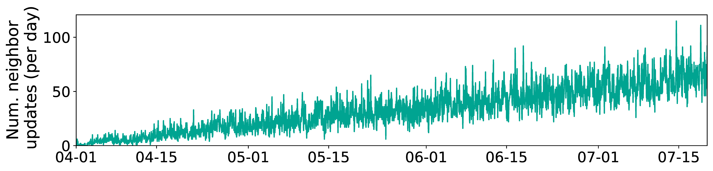

## Figure 15: Neighborship updates w/o maintenance.

<div align=center></div>

### Overview
Figure 15 shows neighborship updates w/o maintenance.


### Experimental methodology
Our experiments are based on Two-line elements from space-track.org.


### How to run the code
```
jupyter notebook
open figure15.ipynb file and run notebook
```

### Data
The data can be found in the `figure15/` folder.

	|- figure15
		|- data
			|- nearest_lw_0719.npy
			|- change_time.npy