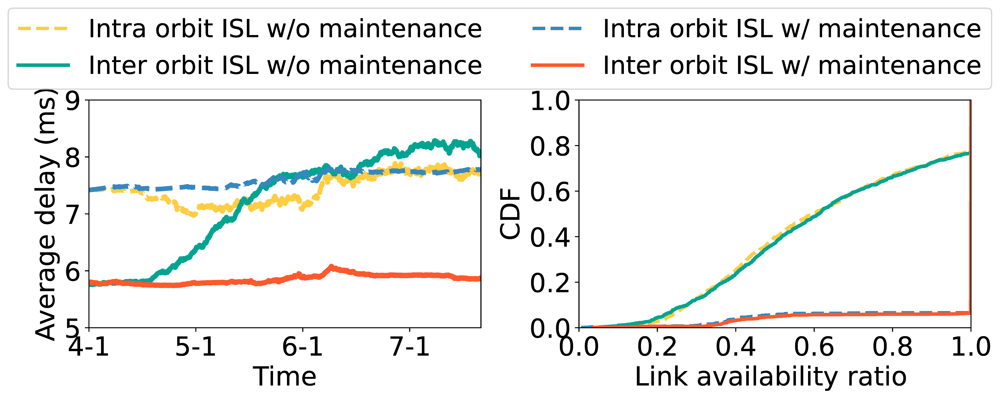

## Figure 16: Orbital maintenance facilitates ISL stability.

<div align=center></div>

### Overview
Figure 16 shows how orbital maintenance facilitates ISL stability.


### Experimental methodology
Our experiments are based on Two-line elements from space-track.org.


### How to run the code
```
jupyter notebook
open nearest_neighbor.ipynb file and run notebook
```

### Data
The data can be found in the `figure16/` folder.

	|- figure16
		|- data
			|- isl_data_decay_v2.npy
			|- isl_data_no_decay_v2.npy