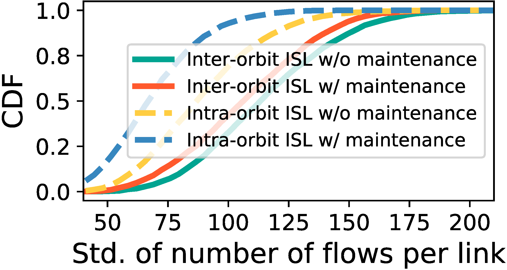
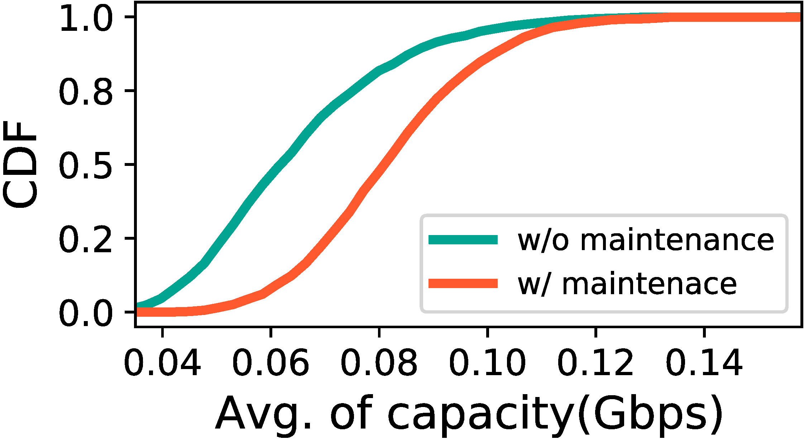

## Figure 17:  Orbital decay’s impacts on 1,000 randomly distributed inter-satellite network traffic flows.

<div align=center></div>
<div align=center></div>

### Overview
Figure 17 shows orbital decay’s impacts on 1,000 randomly distributed inter-satellite network traffic flows.
This figure is to illustrate orbital decay will impact on upper network function.


### Experimental methodology
Our experiments are based on Two-line elements from space-track.org.


### How to run the code
```
jupyter notebook
open figure17.ipynb file and run notebook
```

### Data
The data can be found in the `figure17/` folder.

	|- figure17
		|- data
			|- data.txt
			|- sat_dict_decay.npy
			|- traffic_capacity_avg.npy
			|- ...