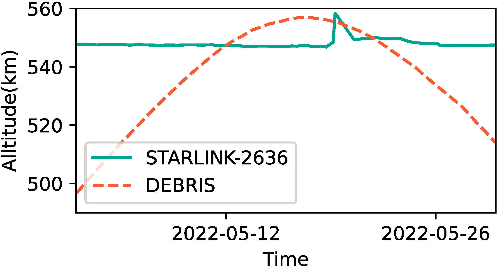
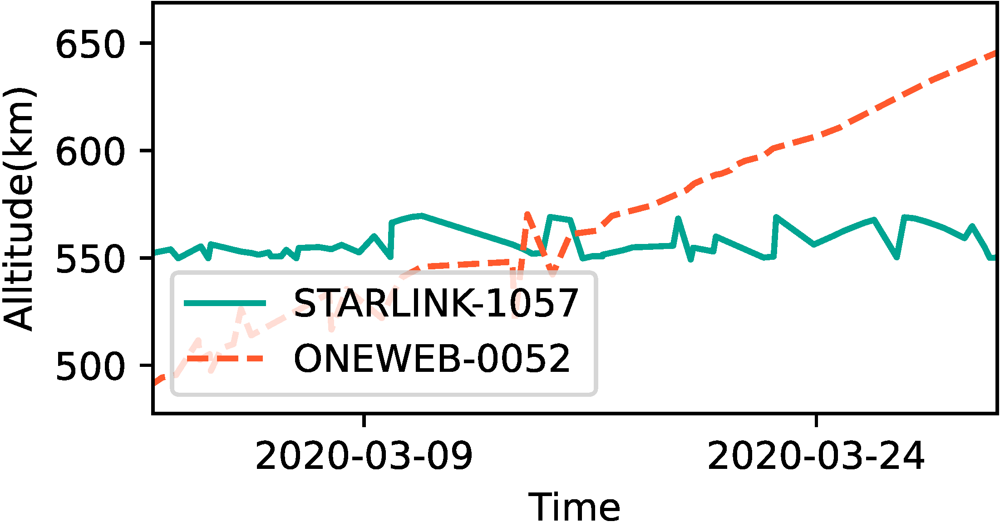
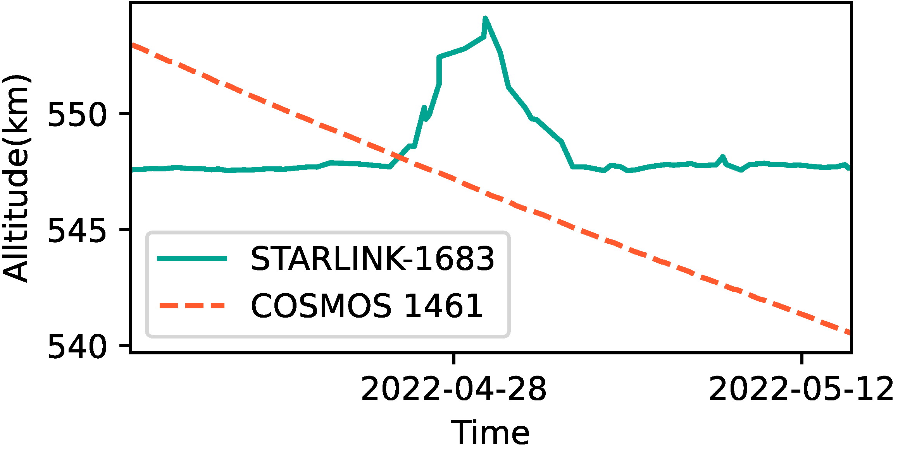
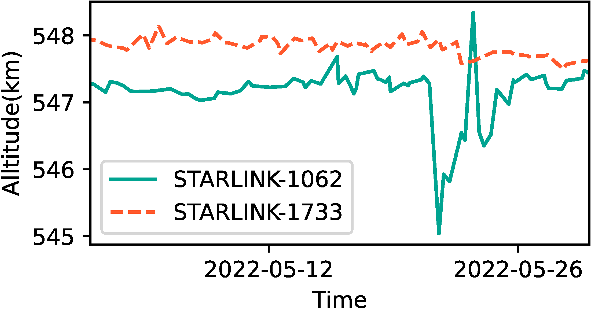

## Figure 18: Classification of collision avoidance in Starlink’s autonomous driving (the solid green line).

<div align=center></div>
<div align=center></div>

### Overview
Figure 18 shows Starlink's collision avoidance maneuvers in 4 different scenarios.

### Experimental methodology
Our experiments are based on Two-line elements from space-track.org.


### How to run the code
```
jupyter notebook
open figure18.ipynb file and run notebook
```

### Data
The data can be found in the `figure18/` folder.

	|- figure18
		|- object_dict.npy