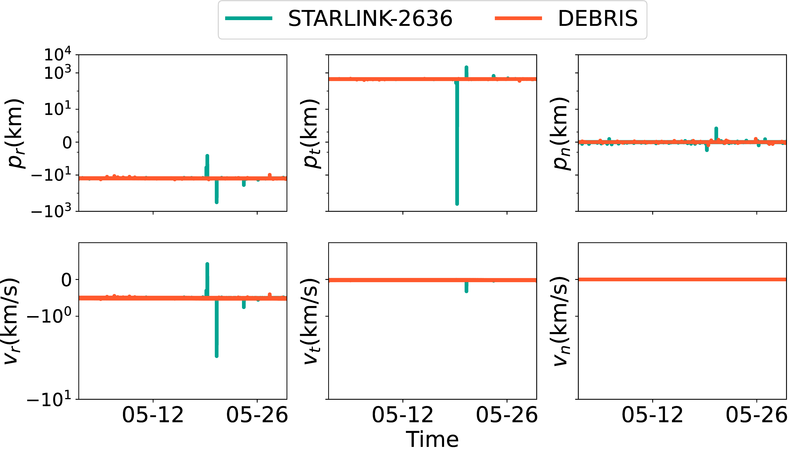

## Figure 19b : A 3D view of Starlink’s collision avoidance maneuver in Figure 18a in the RTN coordinate system.

<div align=center></div>

### Overview
Figure 19b shows a 3D view of Starlink’s collision avoidance maneuver in Figure 18a in the RTN coordinate system.


### Experimental methodology
Our experiments are based on Two-line elements from space-track.org.


### How to run the code
```
jupyter notebook
open figure19b.ipynb file and run notebook
```

### Data
The data can be found in the `figure18/` folder.

	|- figure18
		|- object_dict.npy