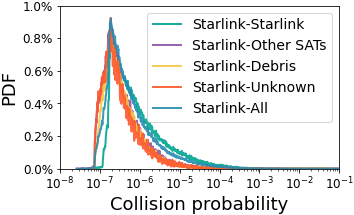
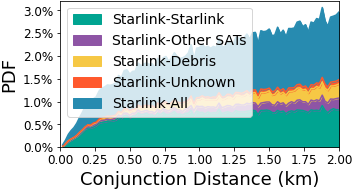

## Figure 20: Collision risks between space objects.

<div align=center></div>

### Overview
Figure 20 shows the statistics for collision probability and miss distance between Starlink and other space objects.


### Experimental methodology
Our experiments are based on counjunction from celestrack.org.


### How to run the code
```
jupyter notebook
open figure20.ipynb file and run notebook
```

### Data
The data can be found in the `figure10/` folder.

	|- figure10
		|- data
			|- frequency_conjunction.npy
			|- plot_distance_data.npy
			|- result.npy