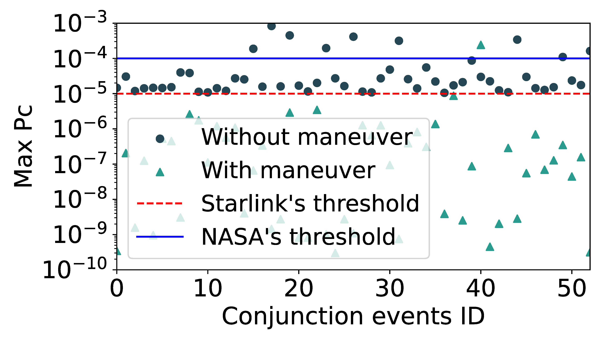

## Figure 21: Effectiveness of collision avoidance.

<div align=center></div>

### Overview
Figure 21 shows the impact of collision avoidance maneuver on collison probabilty and miss distance.


### Experimental methodology
Our experiments are based on Two-line elements from space-track.org.


### How to run the code
```
jupyter notebook
open maneuver_ness_camera_ready.ipynb file and run notebook
```

### Data
The data can be found in the `figure18&19b/` folder.

	|- figure15&27
		|- data
			|- stk_pc2
				|- 14064-46578-2022-04-27 07_21_40.txt
				|- ...
			|- stk_pc4
				|- ...