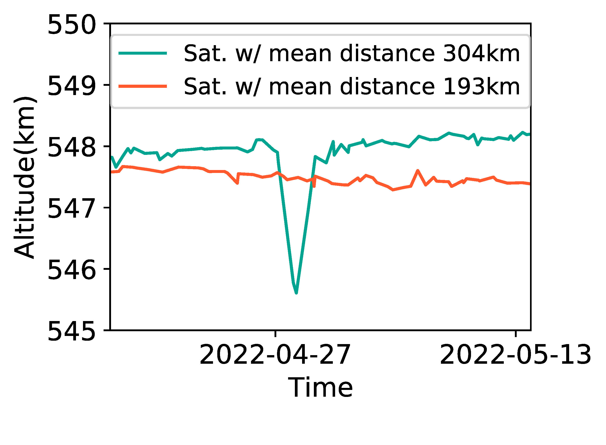
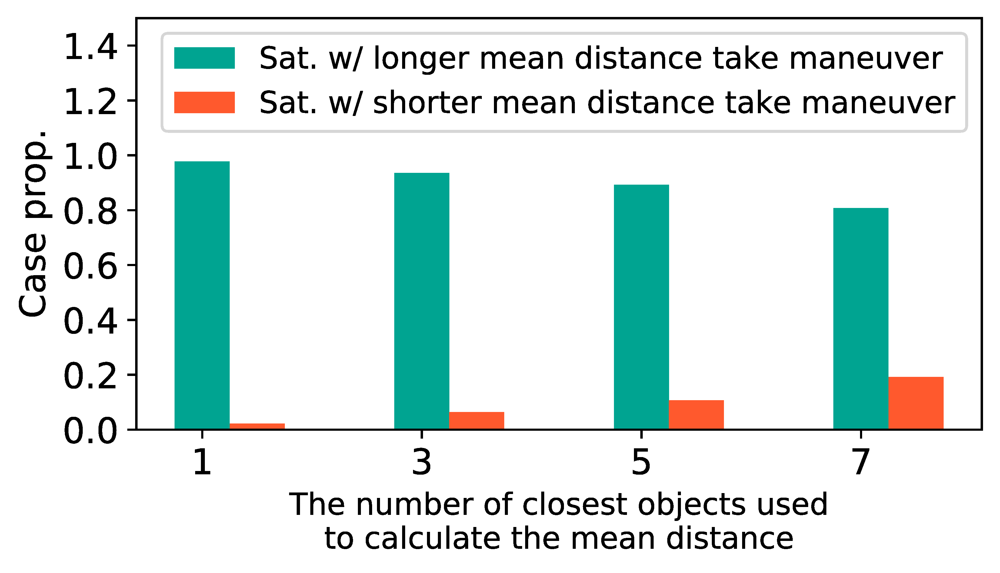

## Figure 22: Cooperative Starlink-Starlink maneuver.

<div align=center></div>

### Overview
Figure 22 shows cooperative Starlink-Starlink maneuver.
This figure is to illustrate Starlink satellites will take cooperative maneuver when they will have collision with each other.


### Experimental methodology
Our experiments are based on Two-line elements from space-track.org.


### How to run the code
```
jupyter notebook
open figure22.ipynb file and run notebook
```

### Data
The data can be found in the `figure22/` folder.

	|- figure22
		|- data
			|- task_maneuver.txt
			|- starlink_dict.npy