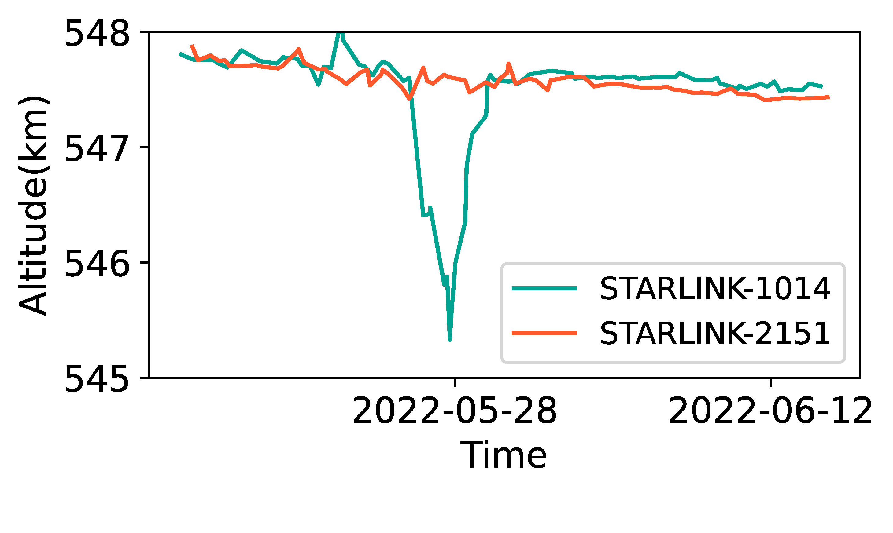

## Figure 23a: A showcase of unnecessary manevuer.

<div align=center></div>

### Overview
Figure 23b shows a showcase of unnecessary manevuer.


### Experimental methodology
Our experiments are based on Two-line elements from space-track.org.


### How to run the code
```
jupyter notebook
open figure23a.ipynb file and run notebook
```

### Data
The data can be found in the `figure23a/` folder.

	|- figure23b
		|- data
			|- starlink_dict.npy