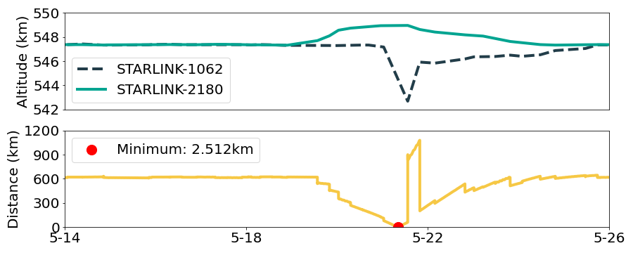

## Figure 24:  Starlink’s high-risk orbital maneuver

<div align=center></div>

### Overview
Figure 24 shows Starlink’s high-risk orbital maneuver.
This figure is to illustrate Starlink's maneuvers can still raise collision risks..


### Experimental methodology
Our experiments are based on Two-line elements from space-track.org.


### How to run the code
```
jupyter notebook
open figure24.ipynb file and run notebook
```

### Data
The data can be found in the `figure24/` folder.

	|- figure24
		|- data
			|- 44767.csv
			|- 47762.csv