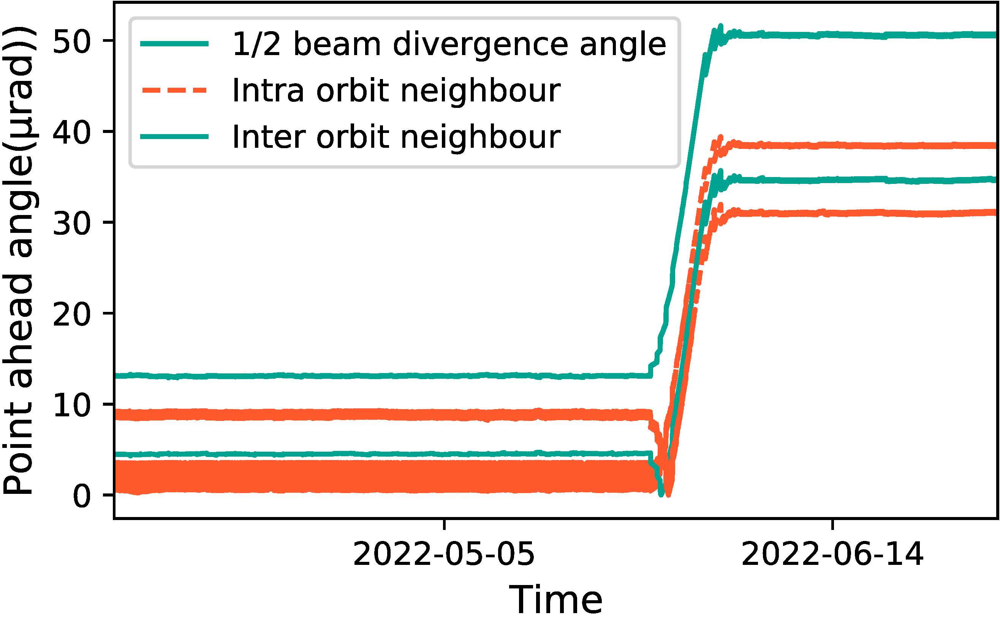

## Figure 25:  ISL’s out-of-alignment by maneuvers

<div align=center></div>

### Overview
Figure 25 shows the impact of maneuvers on ISL alignment.
This figure is to illustrate how maneuvers impact on Point ahead angle and make ISL out-of-alignment.


### Experimental methodology
Our experiments are based on Two-line elements from space-track.org.


### How to run the code
```
jupyter notebook
open figure25.ipynb file and run notebook
```

### Data
The data can be found in the `figure25/` folder.

	|- figure25
		|- data
			|- unnecessary_neigh.npy
			|- relative.npy
			|- time.npy