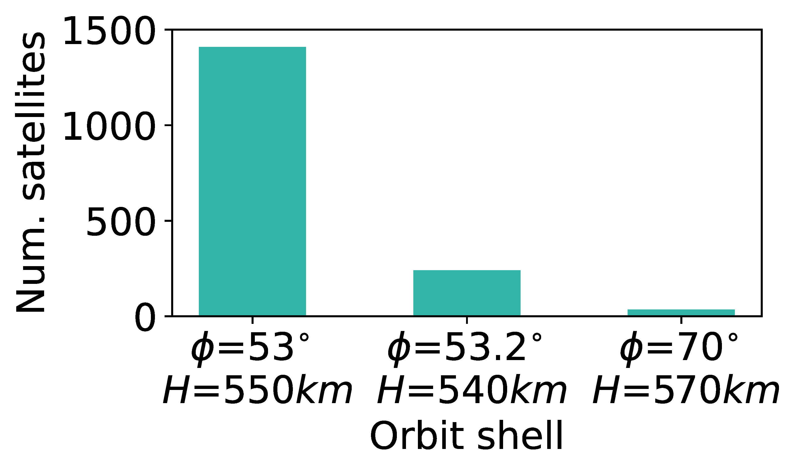
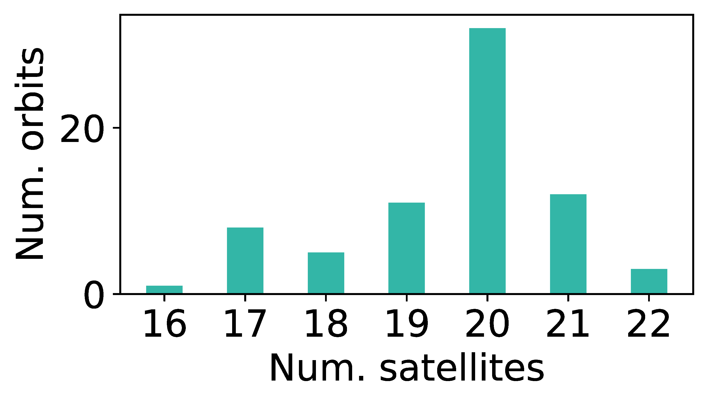
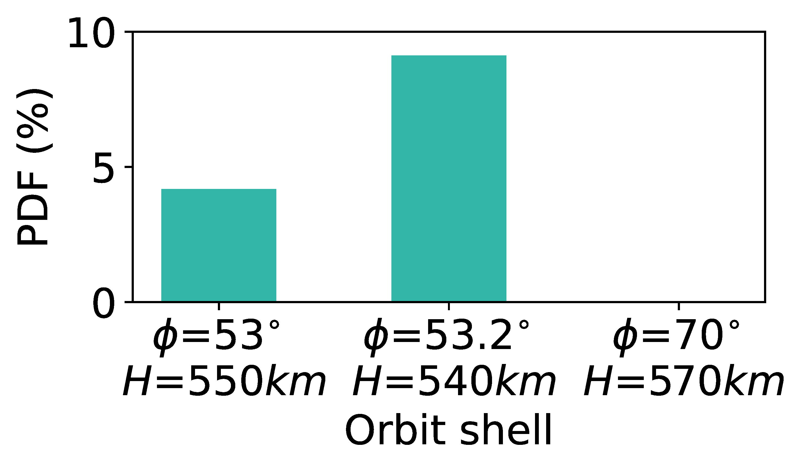
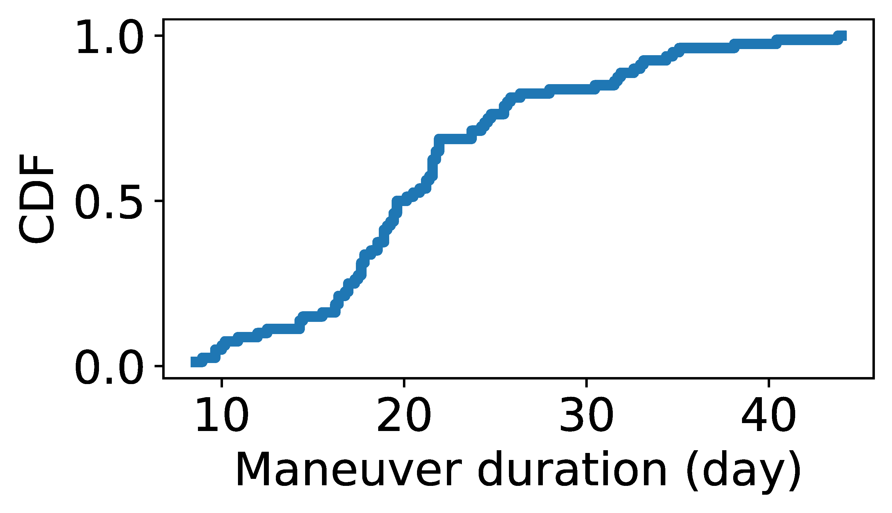

## Figure 26: Starlink’s maneuvers between multiple orbital shells.

<div align=center></div>
<div align=center></div>

### Overview
Figure 26 shows the statistics of maneuvers between shell.


### Experimental methodology
Our experiments are based on Two-line elements from space-track.org.


### How to run the code
```
jupyter notebook
open figure26.ipynb file and run notebook
```

### Data
The data can be found in the `figure26/` folder.

	|- figure26
		|- data.txt
		|- keys.npy
		|- mu_dis.npy
		|- name2orbit.npy
		|- ...