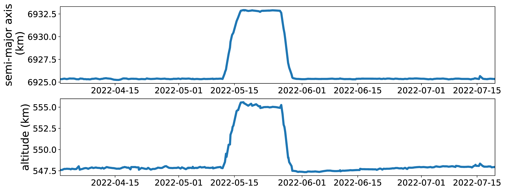

## Figure 27: A showcase of inter-orbit-shell maneuver.

<div align=center></div>

### Overview
Figure 27 shows a showcase of inter-orbit-shell maneuver.


### Experimental methodology
Our experiments are based on Two-line elements from space-track.org.


### How to run the code
```
jupyter notebook
open figure27.ipynb file and run notebook
```

### Data
The data can be found in the `figure27/` folder.

	|- figure27
		|- data
			|- task_maneuver.txt
			|- d.npy
			|- ...