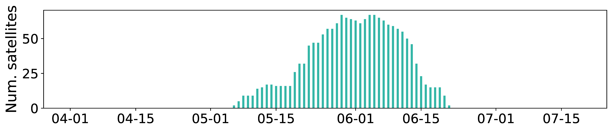

## Figure 28:  The number of satellites conducting interorbit-shell maneuvers per day.

<div align=center></div>

### Overview
Figure 28 shows the number of satellites conducting interorbit-shell maneuvers per day.


### Experimental methodology
Our experiments are based on Two-line elements from space-track.org.


### How to run the code
```
jupyter notebook
open figure28.ipynb file and run notebook
```

### Data
The data can be found in the `figure26&/` folder.

	|- figure26
		|- keys.npy
		|- mu_dis.npy
		|- name2orbit.npy
		|- ...