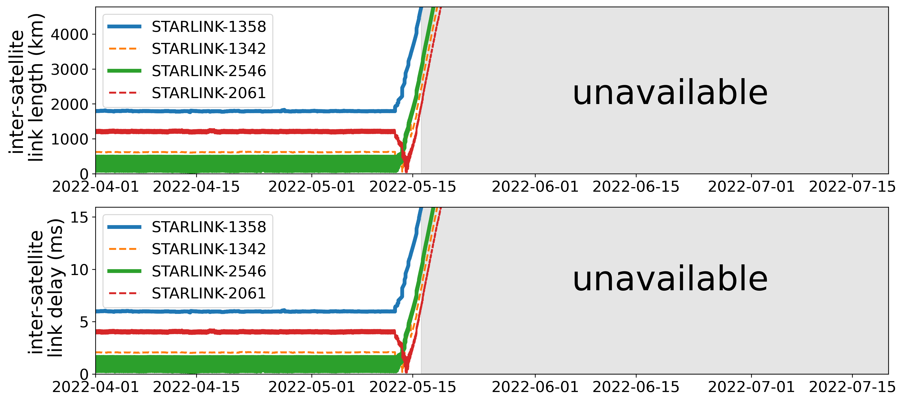

## Figure 31:  ISL’s length and delay under maneuvers

<div align=center></div>

### Overview
Figure 31 shows ISL’s length and delay under maneuvers.
This figure is to illustrate how maneuvers impact on ISL’s length and delay.


### Experimental methodology
Our experiments are based on Two-line elements from space-track.org.


### How to run the code
```
jupyter notebook
open figure31.ipynb file and run notebook
```

### Data
The data can be found in the `figure31/` folder.

	|- figure31
		|- data
			|- names.npy
			|- nearest.npy
			|- pos_cbf.npy