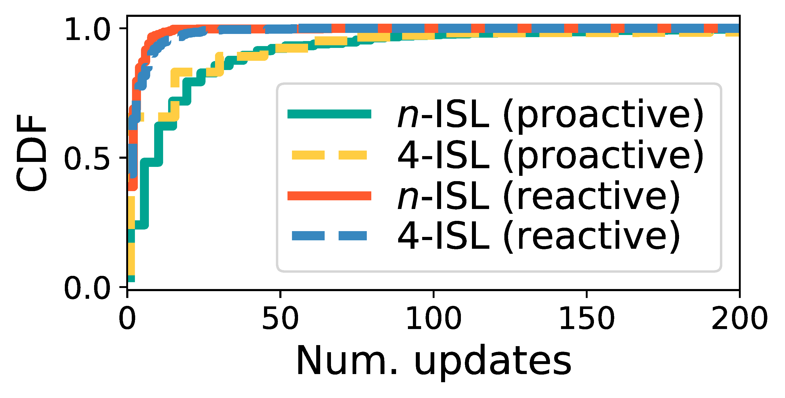
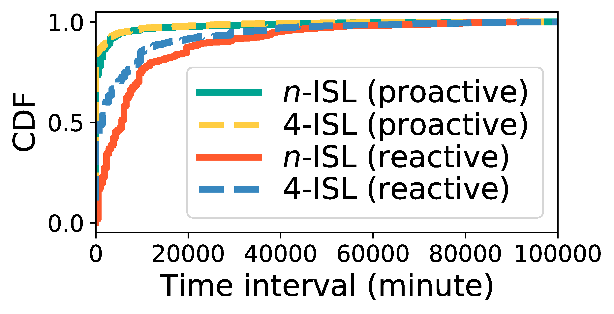
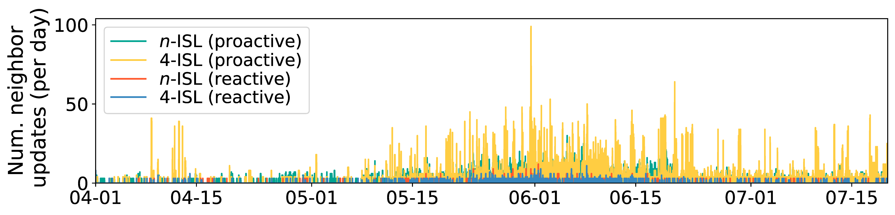

## Figure 32: ISL updates in various networking schemes.

<div align=center></div>
<div align=center></div>

### Overview
Figure 32 shows shows the frequency of ISL updates in the first shell.


### Experimental methodology
Our experiments are based on Two-line elements from space-track.org.


### How to run the code
```
jupyter notebook
open figure32.ipynb file and run notebook
```

### Data
The data can be found in the `figure32/` folder.

	|- figure32
		|- data
			|- neighbor_gnp.npy
			|- ...