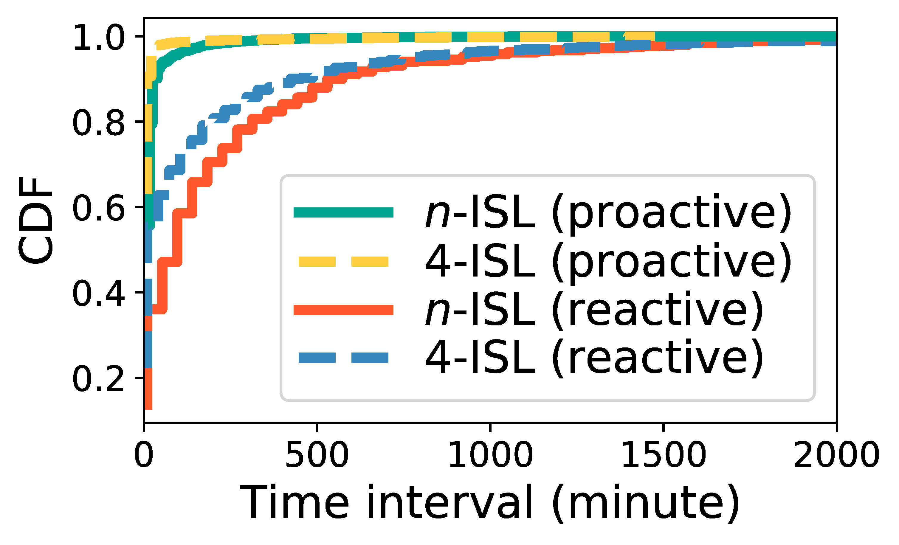

## Figure 33: Topology updates in various schemes.

<div align=center></div>

### Overview
Figure 33 shows topology updates in various schemes.


### Experimental methodology
Our experiments are based on Two-line elements from space-track.org.


### How to run the code
```
jupyter notebook
open figure33.ipynb file and run notebook
```

### Data
The data can be found in the `figure33/` folder.

	|- figure33
		|- data
			|- snap_gnp.npy
			|- ...