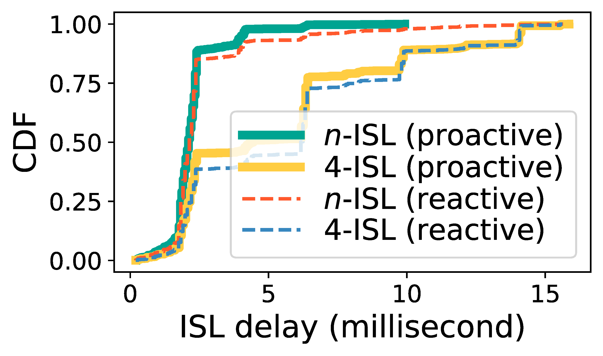

## Figure 34: ISL delay in various networking schemes.

<div align=center></div>

### Overview
Figure 34 shows ISL delay in various networking schemes.


### Experimental methodology
Our experiments are based on Two-line elements from space-track.org.


### How to run the code
```
jupyter notebook
open figure34.ipynb file and run notebook
```

### Data
The data can be found in the `figure34/` folder.

	|- figure34
		|- data
			|- data.txt
			|- isl_gnp_inter.npy
			|- ...