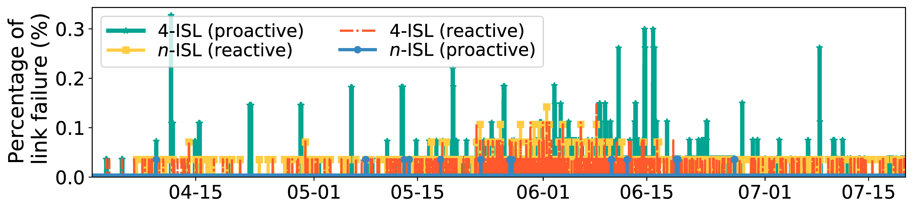

## Figure 35: ISL failures in various networking schemes.

<div align=center></div>

### Overview
Figure 35 shows ISL failures in various networking schemes.


### Experimental methodology
Our experiments are based on Two-line elements from space-track.org.


### How to run the code
```
jupyter notebook
open figure35.ipynb file and run notebook
```

### Data
The data can be found in the `figure35/` folder.

	|- figure35
		|- data
			|- data.txt
			|- linkfail_gnp_1.npy
			|- ...