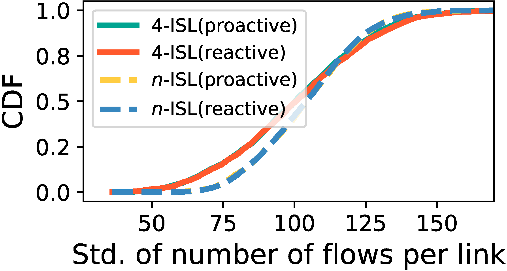
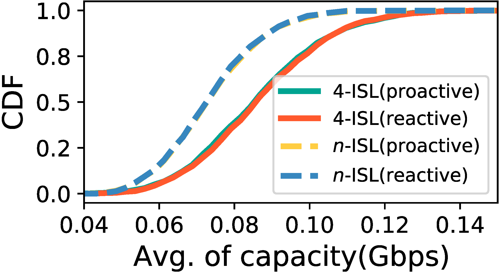

## Figure 36: Traffic performance in various schemes.

<div align=center></div>

### Overview
Figure 36 shows traffic performance in various schemes.


### Experimental methodology
Our experiments are based on Two-line elements from space-track.org.


### How to run the code
```
jupyter notebook
open figure36.ipynb file and run notebook
```

### Data
The data can be found in the `figure36/` folder.

	|- figure36
		|- data
			|- sat_dict_decay.npy
			|- traffic_capacity_avg.npy
			|- ...