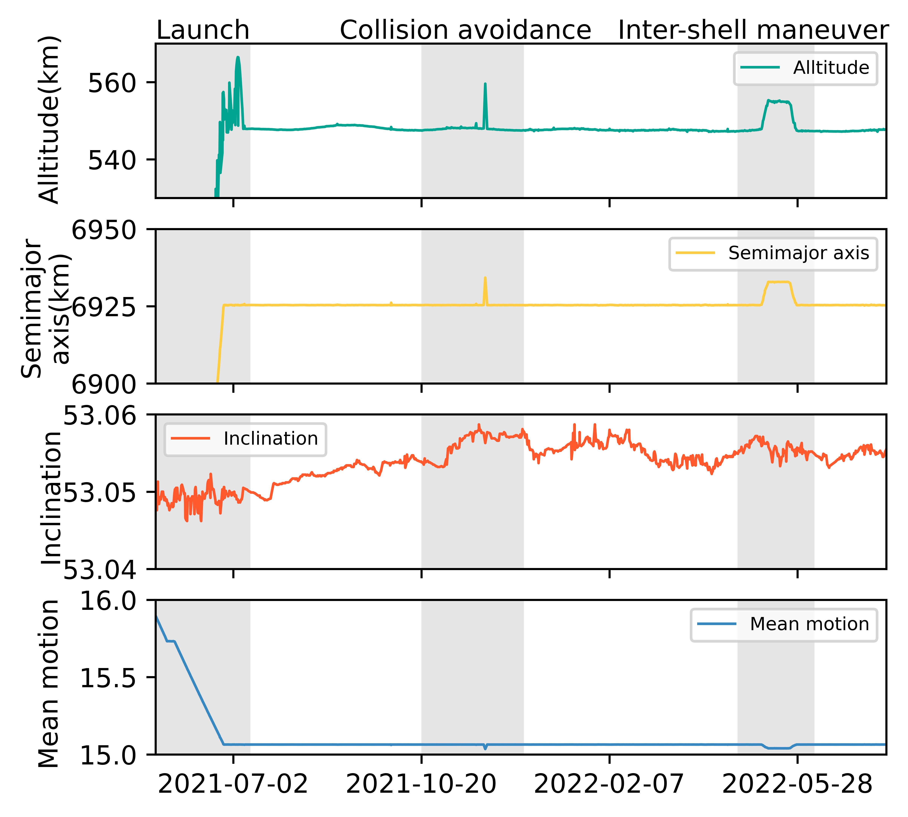

## Figure 6: An example of Starlink satellite’s maneuver behaviors

<div align=center></div>

### Overview
Figure 6 shows an example of Starlink's satellite maneuver behaviors.
This figure is to show in general how starlink satellites will do maneuver behaviors.


### Experimental methodology
Our experiments are based on Two-line element(TLE) from space-track.org.


### How to run the code
```
jupyter notebook
open figure6.ipynb file and run notebook
```

### Data
The data can be found in the `figure6/` folder.

	|- figure6
		|- data
			|- starlink_dict.csv