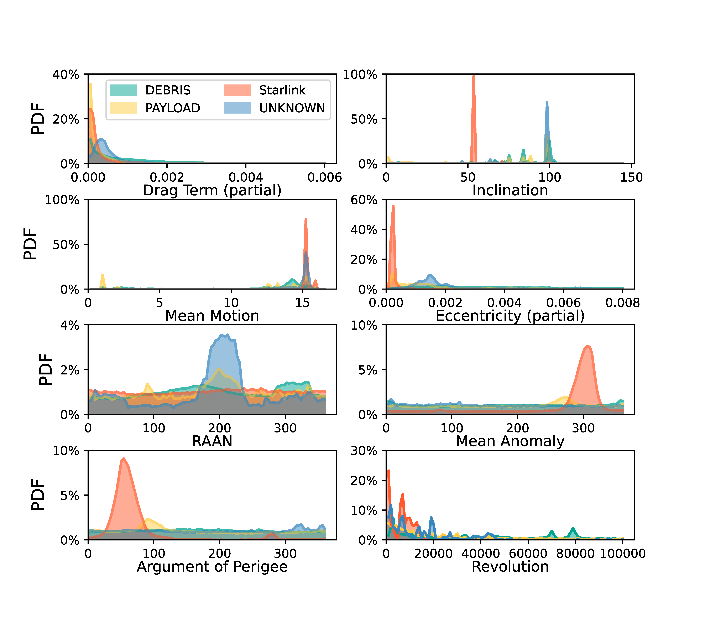

## Figure 9: Orbital parameter distributions in dataset

<div align=center></div>

### Overview
Figure 9 shows space objects' orbital parameter distributions in dataset.


### Experimental methodology
Our experiments are based on Two-line element(TLE) from space-track.org.


### How to run the code
```
jupyter notebook
open figure9.ipynb file and run notebook
```

### Data
The data can be found in the `figure8&9/` folder.

	|- figure8&9
		|- data
			|- data.npy
			|- percentage.npy
			|- type_num.npy