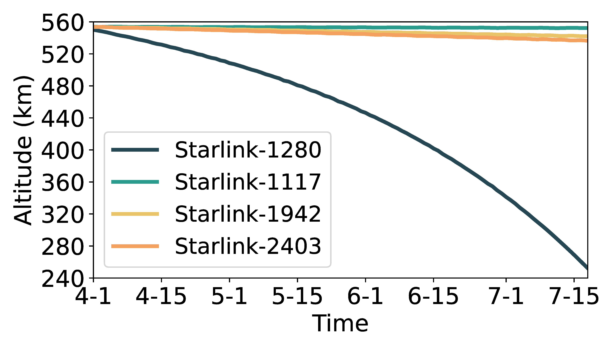

## Figure 12b: Heterogeneous orbital decays if w/o orbit maintenance in Starlink.

<div align=center></div>

### Overview
Figure 12a shows heterogeneous orbital decays ifw/o orbit maintenance in Starlink.


### Experimental methodology
Our experiments are based on Two-line elements from space-track.org.


### How to run the code
```
jupyter notebook
open figure12b.ipynb file and run notebook
```

### Data
The data can be found in the `figure12b/` folder.

	|- figure12b
		|- data
			|- data_decay.npy