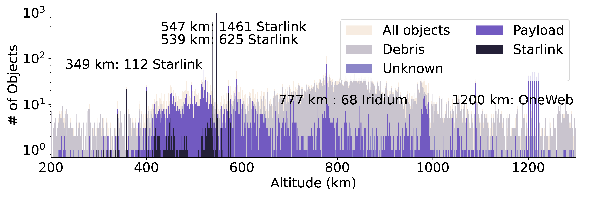

## Figure 4: Distribution of space objects by altitudes

<div align=center></div>

### Overview
Figure 4 shows distribution of space objects by altitudes.
This figure is to demonstrating how crowded low Earth orbit is.


### Experimental methodology
Our experiments are based on Two-line element(TLE) from space-track.org.


### How to run the code
```
jupyter notebook
open figure4.ipynb file and run notebook
```

### Data
The data can be found in the `figure4/` folder.

	|- figure4
		|- data
			|- latest_tle.csv