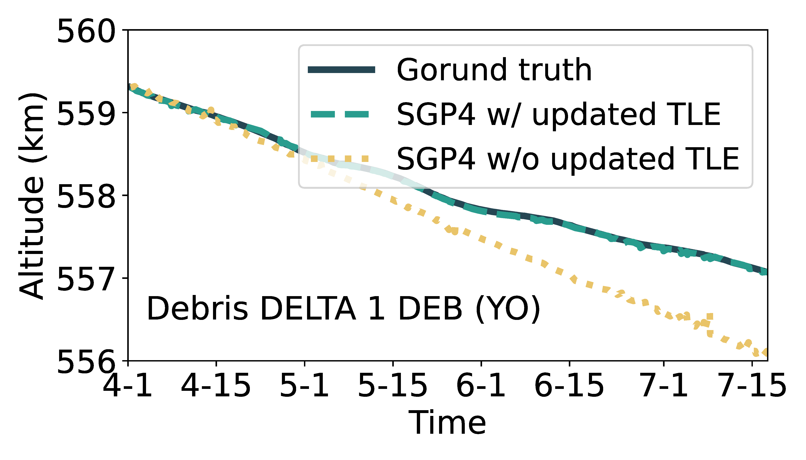

## Figure 8b: SGP4 accuracy w/o maneuvers

<div align=center></div>

### Overview
Figure 8b shows the gap between SGP4 propagation model with/without updated TLE and Ground truth.


### Experimental methodology
Our experiments are based on Two-line element(TLE) from space-track.org.


### How to run the code
```
jupyter notebook
open figure8b.ipynb file and run notebook
```

### Data
The data can be found in the `figure8b/` folder.

	|- figure8b
		|- data
			|- 228.csv